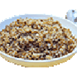

# Grecha.js

Simple Front-End JavaScript Framework. Originally designed for [emoteJAM](https://github.com/tsoding/emoteJAM). The name basically means [buckwheat](https://en.wikipedia.org/wiki/Buckwheat) in russian.
